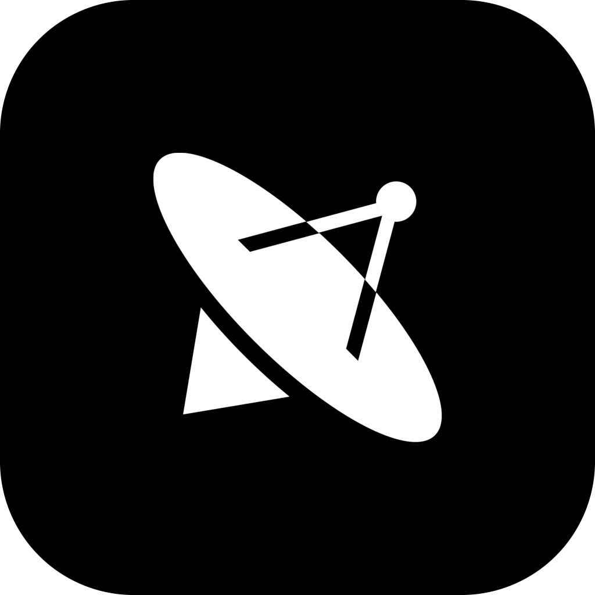

<div align="center">
  <a href="https://voyager.swmansion.com/" target="_blank">
    
  </a>

  <h1>Voyager</h1>

  <p><strong>Observe, debug, and understand running BEAM systems</strong></p>

  <p>A desktop app that connects to any BEAM node and shows you what is actually going on inside it</p>

  <p>
    <a href="https://voyager.swmansion.com/">Website</a>
    ·
    <a href="https://github.com/software-mansion-labs/voyager/releases/latest">Download</a>
    ·
    <a href="https://github.com/software-mansion-labs/voyager/issues/new/choose">Give feedback</a>
    ·
    <a href="https://github.com/software-mansion-labs/voyager/blob/main/LICENSE.md">License</a>
  </p>

</div>

https://github.com/user-attachments/assets/8aa3f69e-a692-4b9d-9bf5-75d972f6370f

## Overview

TODO

### Why Voyager

TODO

## Installation

Download the latest build for your platform from the [website](https://voyager.swmansion.com). Voyager currently ships for:

- macOS (Apple Silicon)
- macOS (Intel)
- Linux (x64)

## Connecting to a node

Voyager needs to reach the target node over Erlang distribution and needs its cookie.

- **Local / remote node** — provide the node name (`myapp@host`) and the cookie. Voyager starts distribution on demand and connects.
- **Over SSH** — provide SSH credentials to a host that can reach the node. Voyager tunnels the distribution connection through it, which is the usual path to a production node behind a bastion.

The target node must have distribution enabled — a node started without a name is not distributed and cannot be connected to at all. Give it a name and a cookie at boot, and make sure the name type matches the toggle next to the node name field:

```sh
# long names — use the `--name` toggle in Voyager
iex --name my_app@127.0.0.1 --cookie my-secret-cookie -S mix phx.server
```

For a Mix release, set the equivalent environment variables instead:

```sh
RELEASE_DISTRIBUTION=name RELEASE_NODE=my_app@10.0.0.5 RELEASE_COOKIE=my-secret-cookie bin/my_app start
```

Recent connections are saved in a local SQLite database; secrets are encrypted before being written.

Distribution settings (node name, cookie handling) are configurable under **Settings → Distribution**.

## MCP server

Voyager can expose the connected node to MCP clients such as Claude Code or Cursor, so an agent can inspect a live system instead of guessing from source code.

Enable it under **Settings → MCP** and pick a port. Point your MCP client at the resulting HTTP endpoint. The tool operates on whichever node Voyager is currently connected to.

## Feedback and contributing

Voyager is in active development and feedback shapes what gets built next.

- Found a bug, want a feature, or just have thoughts? [Open an issue](https://github.com/software-mansion-labs/voyager/issues/new/choose) — there are templates for bug reports, feature requests, and general feedback.
- Pull requests are welcome. Fork the repo, run `mix precommit` before pushing, and describe what you changed and why.

## Development

Prerequisites are pinned in [`.tool-versions`](.tool-versions):

```
elixir 1.20.2-otp-29
erlang 29.0.2
nodejs 26.4.0
rust  1.96.0
```

Install dependencies and set up the database:

```sh
mix setup
```

Run the web app on its own:

```sh
mix phx.server
# or
iex -S mix phx.server
```

Then visit [localhost:4000](http://localhost:4000).

Run the desktop application in development:

```sh
mix tauri.dev
```

To check the production desktop app locally:

```sh
mix assets.deploy
mix tauri.app
```

Before opening a pull request, run:

```sh
mix precommit
```

## License

Voyager's source code is publicly available, but it is **not** open source under the OSI definition. Use is governed by the [Voyager User License](LICENSE.md):

- **Free License** — free for individuals, for-profit organizations with up to 10 employees, and non-profits, including commercial use.
- **Company License** — required for larger for-profit organizations using Voyager commercially. Includes prioritized support.

Either tier lets you observe, debug, and understand running systems, and modify the code for internal use or to contribute back. Reselling Voyager or offering it as a hosted "as-a-Service" product is not permitted.

There is a 90-day free evaluation period, and a 90-day grace period if you grow past the size threshold while using Voyager.

See [LICENSE.md](LICENSE.md) for the exact terms and a detailed FAQ, and [website](https://voyager.swmansion.com/) for pricing and to purchase a Company License.

## Authors

Voyager is created by Software Mansion

Since 2012 [Software Mansion](https://swmansion.com/?utm_source=git&utm_medium=readme&utm_campaign=voyager) is a software agency with experience in building web and mobile apps as well as complex multimedia solutions. We are Core React Native Contributors, Elixir ecosystem experts, and live streaming and broadcasting technologies specialists. We can help you build your next dream product – [Hire us](https://swmansion.com/contact/projects?utm_source=git&utm_medium=readme&utm_campaign=voyager).

[](https://swmansion.com/?utm_source=git&utm_medium=readme&utm_campaign=voyager)

Copyright 2026, [Software Mansion](https://swmansion.com/?utm_source=git&utm_medium=readme&utm_campaign=voyager)
