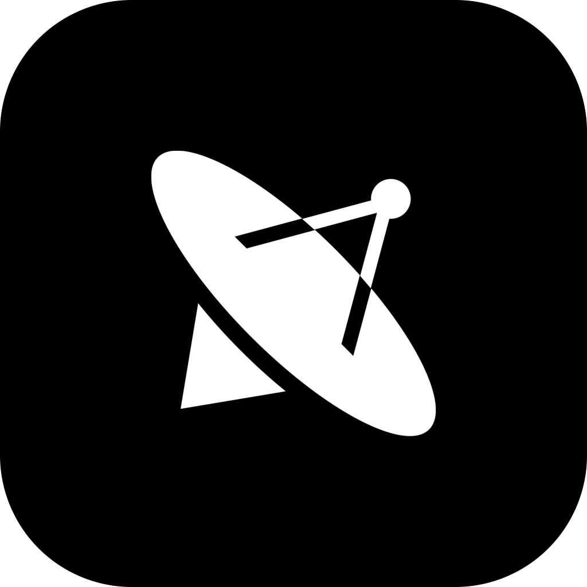

<div align="center">
  <a href="https://voyager.swmansion.com/" target="_blank">
    
  </a>

  <h1>Voyager</h1>

  <p><strong>Observe, debug, and understand running BEAM systems</strong></p>

  <p>A desktop app that connects to any BEAM node and shows you what is actually going on inside it</p>

  <p>
    <a href="https://voyager.swmansion.com/">Website</a>
    ·
    <a href="https://voyager.swmansion.com/download">Download</a>
    ·
    <a href="https://github.com/software-mansion/voyager/issues/new/choose">Give feedback</a>
    ·
    <a href="LICENSE.md">License</a>
  </p>

</div>

[](https://swm-delivery.com/www/delivery/ck-slug.php?zoneid=zone-gh-voyager-1&n=1)
[](https://swm-delivery.com/www/delivery/ck-slug.php?zoneid=zone-gh-voyager-2&n=1)
[](https://swm-delivery.com/www/delivery/ck-slug.php?zoneid=zone-gh-voyager-3&n=1)

https://github.com/user-attachments/assets/8aa3f69e-a692-4b9d-9bf5-75d972f6370f

## Overview

Voyager is a desktop app that inspects running BEAM systems — supervision trees, processes, ETS tables, memory and IO usage, running applications, and more — through one interface instead of a patchwork of shell commands copy-pasted into `iex`. It connects to any OTP 27+ node, local or remote, over plain Erlang distribution and surfaces the information the BEAM already exposes, in a form that is actually pleasant to read.

No setup is required on the target node. On connect, Voyager compiles and loads a small helper module (`voyager_agent`) into the node's memory and gathers everything else over RPC; nothing is written to the node's disk, and all rendering and storage happens on your machine.

### Why Voyager

- **No setup on the target** — no dependency in your app, no hook in your release. If the node is distributed and runs OTP 27+, Voyager can attach to it.
- **The whole BEAM, not one framework** — Erlang, Elixir, Gleam. Voyager speaks the distribution protocol, not framework internals.
- **Production without a remote shell** — connect over SSH and inspect a deployed node directly, instead of opening a shell and piecing the picture together by hand.
- **First-class AI support** — the same data is exposed over MCP, so a coding agent can read a live system instead of guessing from source code.
- **Built to be read** — a graphical, navigable view of process hierarchies and runtime numbers, which also makes it a good way to learn how OTP actually behaves.

## Installation

Download the latest build for your platform from the [website](https://voyager.swmansion.com/download). Voyager currently ships for:

- macOS (Apple Silicon)
- macOS (Intel)
- Linux (x64) — distributed as an AppImage, see [docs/linux_appimage_guide.md](docs/linux_appimage_guide.md) for how to run and install it

The app checks for a new release on startup and can install it in place; the current version and update status are under **Settings → Updates**.

## Connecting to a node

Voyager connects to any distributed node running **OTP 27 or later**, either directly or through an SSH tunnel to a host that can reach it, which is the usual path to a production node behind a bastion. Start the node with a name and a cookie, then enter both in the connect form:

```sh
# Elixir
iex --name my_app@127.0.0.1 --cookie my-secret-cookie -S mix phx.server
# Erlang
erl -name my_app@127.0.0.1 -setcookie my-secret-cookie
```

See [docs/connecting_to_a_node.md](docs/connecting_to_a_node.md) for short names, releases, IPv6, the SSH setup, how saved connections are stored, and troubleshooting.

## MCP server

Voyager can expose the connected node to MCP clients such as Claude Code or Cursor, so an agent can inspect a live system instead of guessing from source code.

Enable it under **Settings → MCP Server** and pick a port (default `4040`). Point your MCP client at `http://127.0.0.1:<port>/mcp`; the endpoint only listens on loopback and rejects requests from non-local origins. The tools operate on whichever node Voyager is currently connected to:

- `node_info` — system, memory, runtime, limits and scheduler snapshot
- `process_list` / `process_info` — rank processes by an attribute, then read one process's details
- `ets_list` / `ets_read_table_chunk` / `ets_search_table` — list ETS tables, page through one, or query it with a match spec

## Feedback and contributing

Voyager is in active development and feedback shapes what gets built next.

- Questions, ideas, or first impressions? Head to [Discussions](https://github.com/software-mansion/voyager/discussions) — [Q&A](https://github.com/software-mansion/voyager/discussions/categories/q-a) for help, [Ideas](https://github.com/software-mansion/voyager/discussions/categories/ideas) for feature proposals, [General](https://github.com/software-mansion/voyager/discussions/categories/general) for everything else.
- Found a reproducible bug or want to file a concrete request? [Open an issue](https://github.com/software-mansion/voyager/issues/new/choose) — there are templates for bug reports, feature requests, and general feedback.
- Pull requests are welcome. Fork the repo, run `mix precommit` before pushing, and describe what you changed and why.

## Development

With the tool versions from [`.tool-versions`](.tool-versions) installed:

```sh
mix setup
mix phx.server   # web app at localhost:4000
mix tauri.dev    # desktop app
```

See [docs/development.md](docs/development.md) for prerequisites, SSH tunnels in development, local production builds, and the checks to run before opening a pull request.

## License

Voyager's source code is publicly available, but it is **not** open source under the OSI definition. Use is governed by the [Voyager User License](LICENSE.md):

- **Free License** — free for individuals, for-profit organizations with up to 10 employees, and non-profits, including commercial use.
- **Company License** — required for larger for-profit organizations using Voyager commercially. Includes prioritized support.

Either tier lets you observe, debug, and understand running systems, and modify the code for internal use or to contribute back. Reselling Voyager or offering it as a hosted "as-a-Service" product is not permitted.

There is a 90-day free evaluation period, and a 90-day grace period if you grow past the size threshold while using Voyager.

See [LICENSE.md](LICENSE.md) for the exact terms and a detailed FAQ, and [website](https://voyager.swmansion.com/) for pricing and to purchase a Company License.

## Authors

Voyager is created by Software Mansion

Since 2012 [Software Mansion](https://swmansion.com/?utm_source=git&utm_medium=readme&utm_campaign=voyager) is a software agency with experience in building web and mobile apps as well as complex multimedia solutions. We are Core React Native Contributors, Elixir ecosystem experts, and live streaming and broadcasting technologies specialists. We can help you build your next dream product – [Hire us](https://swmansion.com/contact/projects?utm_source=git&utm_medium=readme&utm_campaign=voyager).

[](https://swmansion.com/?utm_source=git&utm_medium=readme&utm_campaign=voyager)

Copyright 2026, [Software Mansion](https://swmansion.com/?utm_source=git&utm_medium=readme&utm_campaign=voyager)
